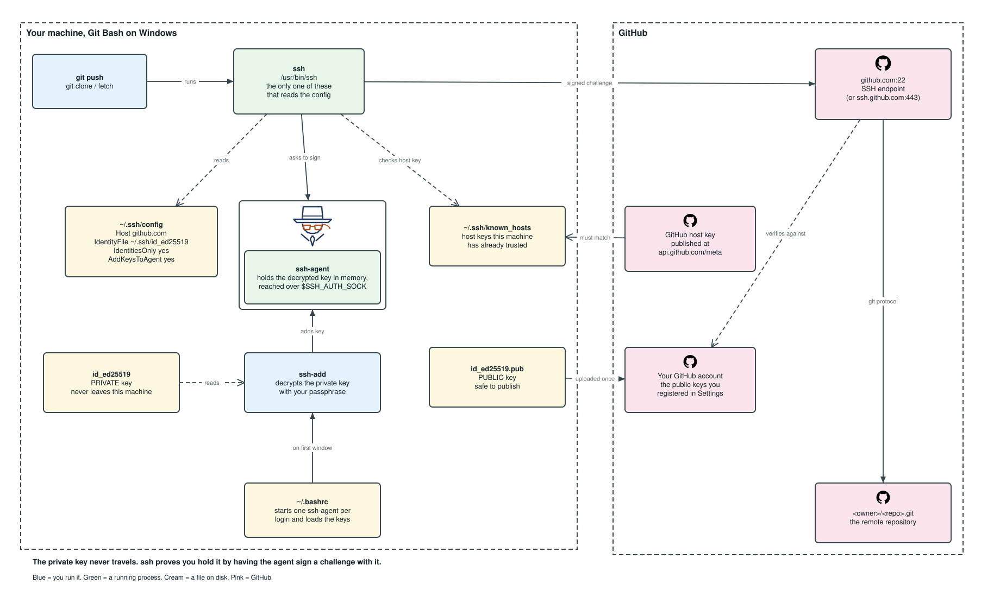

# GitHub SSH Setup, Start to Finish (Git Bash)

Practical runbook for creating an SSH (Secure Shell) key, loading it into the `ssh-agent`, registering it with GitHub, and proving the whole chain works.

Everything here targets Git Bash on Windows and assumes you are typing into it. Most of the commands are plain POSIX (Portable Operating System Interface) shell and would carry over to macOS or Linux unchanged, but this document does not cover those platforms, because the parts that make it work are Windows specific: `clip.exe`, `winpty`, `MSYS_NO_PATHCONV` and `/c/...` drive paths.

Every command is copy pasteable.

---

<!-- toc -->

## Contents

[Figures](#figures)  
[1. Git Bash specifics you need to know first](#1-git-bash-specifics-you-need-to-know-first)  
[2. Quick path (if you just want it working)](#2-quick-path-if-you-just-want-it-working)  
[3. The full procedure](#3-the-full-procedure)  
&nbsp;&nbsp;&nbsp;&nbsp;[3.1 See what you already have](#31-see-what-you-already-have)  
&nbsp;&nbsp;&nbsp;&nbsp;[3.2 Choose a key type (ranked)](#32-choose-a-key-type-ranked)  
&nbsp;&nbsp;&nbsp;&nbsp;[3.3 Generate the key](#33-generate-the-key)  
&nbsp;&nbsp;&nbsp;&nbsp;[3.4 Get the `ssh-agent` running](#34-get-the-ssh-agent-running)  
&nbsp;&nbsp;&nbsp;&nbsp;[3.5 Load the key into the `ssh-agent`](#35-load-the-key-into-the-ssh-agent)  
&nbsp;&nbsp;&nbsp;&nbsp;[3.6 Verify the `ssh-agent` and the loaded keys](#36-verify-the-ssh-agent-and-the-loaded-keys)  
&nbsp;&nbsp;&nbsp;&nbsp;[3.7 Register the public key with GitHub (ranked)](#37-register-the-public-key-with-github-ranked)  
&nbsp;&nbsp;&nbsp;&nbsp;[3.8 Test the connection to GitHub manually](#38-test-the-connection-to-github-manually)  
&nbsp;&nbsp;&nbsp;&nbsp;[3.9 Verify you are talking to the real GitHub](#39-verify-you-are-talking-to-the-real-github)  
&nbsp;&nbsp;&nbsp;&nbsp;[3.10 The `~/.ssh/config` file](#310-the-sshconfig-file)  
&nbsp;&nbsp;&nbsp;&nbsp;[3.11 Make Git actually use the key](#311-make-git-actually-use-the-key)  
[4. Start the `ssh-agent` automatically in every Git Bash window](#4-start-the-ssh-agent-automatically-in-every-git-bash-window)  
&nbsp;&nbsp;&nbsp;&nbsp;[4.1 Check that Git Bash reads `~/.bashrc` at startup](#41-check-that-git-bash-reads-bashrc-at-startup)  
&nbsp;&nbsp;&nbsp;&nbsp;[4.2 Add the startup block](#42-add-the-startup-block)  
&nbsp;&nbsp;&nbsp;&nbsp;[4.3 Apply it and confirm it works](#43-apply-it-and-confirm-it-works)  
&nbsp;&nbsp;&nbsp;&nbsp;[4.4 Load more than one key](#44-load-more-than-one-key)  
&nbsp;&nbsp;&nbsp;&nbsp;[4.5 What happens when a key has a passphrase](#45-what-happens-when-a-key-has-a-passphrase)  
&nbsp;&nbsp;&nbsp;&nbsp;[4.6 What to expect, and how to undo it](#46-what-to-expect-and-how-to-undo-it)  
[5. Multiple GitHub accounts or keys](#5-multiple-github-accounts-or-keys)  
[6. Optional: sign commits with the same SSH key](#6-optional-sign-commits-with-the-same-ssh-key)  
[7. File permissions](#7-file-permissions)  
[8. Troubleshooting matrix](#8-troubleshooting-matrix)  
[9. Full verification checklist](#9-full-verification-checklist)  
[10. Cheat sheet](#10-cheat-sheet)  
[11. Terminology](#11-terminology)  
[12. References (every link checked, HTTP 200)](#12-references-every-link-checked-http-200)

<!-- /toc -->

## Figures

[Figure 1. How Git, `ssh`, the `ssh-agent`, your two key halves and GitHub fit together](#3-the-full-procedure)

---

## 1. Git Bash specifics you need to know first

1. `~` is your home directory and `~/.ssh` is where every key lives. Confirm where you are:
   ```bash
   echo "$HOME" && pwd
   ```
2. Git Bash ships its own OpenSSH at `/usr/bin/ssh`, and Git calls it by default. Leave `core.sshCommand` unset so `git`, `ssh` and `ssh-add` all use that one client and therefore one `ssh-agent`. Verify with:
   ```bash
   which -a ssh && git config --global --get core.sshCommand
   ```
   You want `/usr/bin/ssh` and empty output.
3. Drive letters are mounted under a single slash, so a folder like `C:\git\<repo>` is `/c/git/<repo>`.
4. Paths starting with `/` are sometimes rewritten by MSYS2 (the Unix compatibility layer Git Bash is built on). If an argument gets mangled, prefix the command with `MSYS_NO_PATHCONV=1`.
5. If an interactive prompt hangs or you see `the input device is not a TTY`, prefix the command with `winpty`, for example `winpty ssh -T git@github.com`.
6. `clip.exe` is the clipboard helper Git Bash gives you, used in [section 3.7](#37-register-the-public-key-with-github-ranked).
7. **Every step below that runs a command starts with a "Run from" line** telling you which directory to be in. Most steps work from anywhere because the paths are absolute, but the Git steps genuinely need you to be inside a repository. Check where you are at any time:
   ```bash
   pwd
   ```

---

## 2. Quick path (if you just want it working)

**Run from:** anywhere. Every path below is absolute (`~/.ssh/...`), so the current directory does not matter. If you want to be certain, start at your home directory:

```bash
cd ~ && pwd
```

Generate the key pair:

```bash
ssh-keygen -t ed25519 -C "<email>" -f ~/.ssh/id_ed25519
```

Start an `ssh-agent` in this shell:

```bash
eval "$(ssh-agent -s)"
```

Load the key into it, typing the passphrase once:

```bash
ssh-add ~/.ssh/id_ed25519
```

Copy the **public** key to the clipboard:

```bash
cat ~/.ssh/id_ed25519.pub | clip.exe
```

Paste the clipboard into <https://github.com/settings/keys>, then verify:

```bash
ssh -T git@github.com
```

Expected: `Hi <username>! You've successfully authenticated, but GitHub does not provide shell access.`

Make the `ssh-agent` survive new Git Bash windows with the `~/.bashrc` block in [section 4](#4-start-the-ssh-agent-automatically-in-every-git-bash-window). The rest of this document explains each step and every verification command.

---

## 3. The full procedure

Before the steps, here is what you are building. Every box below is something these eleven steps create, configure or check, and the arrows are what talks to what:



**Figure 1.** How Git, `ssh`, the `ssh-agent`, your two key halves and GitHub fit together. The one thing to take from it is that the private key never leaves the machine: `ssh` proves you hold it by having the `ssh-agent` sign a challenge with it.

Eleven steps, in order. Each step is numbered so you can jump straight back to it: step 4 is [section 3.4](#34-get-the-ssh-agent-running), and its sub steps are 3.4.1 onward. If you followed the quick path above and it worked, you only need the steps that failed.

---

### 3.1 See what you already have

**Run from:** `~/.ssh`, so the listing below shows what you expect. Create the directory if it is not there yet:

```bash
mkdir -p ~/.ssh && chmod 700 ~/.ssh && cd ~/.ssh && pwd
```

Expected output: `/c/Users/<username>/.ssh`

#### 3.1.1 Which SSH client is this shell using?

A machine can carry several OpenSSH installations, and mixing them is the cause of most "it works in one terminal but not the other" confusion. List every one on the path:

```bash
which -a ssh ssh-add ssh-keygen
```

Then check the version of the one that wins:

```bash
ssh -V
```

1. Confirm the winner is `/usr/bin/ssh`, the Git Bash OpenSSH, which is the assumption of this whole guide. Windows ships a second OpenSSH under `/c/Windows/System32/OpenSSH`, and that one keeps its own separate `ssh-agent`, so a key loaded here is invisible to it.
2. Check which client Git itself will call:
   ```bash
   git config --global --get core.sshCommand
   ```
   Empty output means Git uses `/usr/bin/ssh`, which is what you want. If it prints a path, clear it:
   ```bash
   git config --global --unset core.sshCommand
   ```

#### 3.1.2 Do keys already exist?

Look before you generate, because a new key with a default name overwrites an old one without asking twice. The `-a` flag matters here, since most of these files are hidden:

```bash
ls -la ~/.ssh
```

1. Files with no extension (`id_ed25519`, `id_rsa`) are **private** keys. Never share or paste these.
2. Files ending `.pub` are **public** keys. These are what GitHub wants.
3. `known_hosts`, `config`, `authorized_keys` are not keys.

#### 3.1.3 Fingerprint every key you already have

A fingerprint is how you tell which local file corresponds to which key registered on GitHub. Print one for every public key in the directory:

```bash
for f in ~/.ssh/*.pub; do ssh-keygen -l -f "$f"; done
```

Output format: `256 SHA256:<fingerprint> <comment> (ED25519)`. Compare that fingerprint against what GitHub lists at <https://github.com/settings/keys> to know which local key matches which registered key.

---

### 3.2 Choose a key type (ranked)

Four types worth considering, and one group to avoid outright:

| Rank | Option | Flag | Why / why not |
|------|--------|------|---------------|
| 1 | **Ed25519** | `-t ed25519` | Best default. Small, fast, strong, supported by GitHub and every OpenSSH 7.0+ (2015 onward). |
| 2 | **Ed25519 on a hardware key (FIDO2, Fast IDentity Online v2)** | `-t ed25519-sk` | Highest security, the private key cannot be copied off the device. Needs OpenSSH 8.2+ and the physical key present at every use. |
| 3 | **ECDSA (Elliptic Curve Digital Signature Algorithm) on a hardware key** | `-t ecdsa-sk` | Same hardware benefit, use only if your security key predates `ed25519-sk` support. |
| 4 | **RSA (Rivest Shamir Adleman) 4096** | `-t rsa -b 4096` | Only for old servers or tooling that cannot parse Ed25519. Bigger and slower. |
| x | **DSA (Digital Signature Algorithm), RSA 1024/2048** | n/a | Do not use. DSA is removed from modern OpenSSH, small RSA is deprecated. |

Recommendation: **option 1**, unless you own a security key, in which case **option 2**. Hardware backed keys need OpenSSH 8.2 or newer, so check `ssh -V` first.

---

### 3.3 Generate the key

**Run from:** `~/.ssh`. This is where Git Bash and `gh` look by default, so keys kept anywhere else need extra configuration for no benefit.

```bash
cd ~/.ssh && pwd
```

The `-f ~/.ssh/...` argument in each command below is absolute, so the key lands in the right place even if you forget to `cd`. Being in `~/.ssh` just means `ls` immediately shows you the result.

#### 3.3.1 Ed25519 (recommended)

Generate the pair. The flags are explained immediately below, so you can read them before running anything:

```bash
ssh-keygen -t ed25519 -C "<email>" -f ~/.ssh/id_ed25519
```

1. `-t` = key type.
2. `-C` = comment, conventionally your email. Purely a label to help you identify the key later.
3. `-f` = output file. Naming per purpose (for example `~/.ssh/id_ed25519_work`) keeps multi account setups sane.
4. You are prompted for a passphrase. **Use one.** The `ssh-agent` means you only type it once per session.

#### 3.3.2 RSA fallback

Use this only when something in your toolchain cannot parse Ed25519. The `-b 4096` is not optional in practice, because shorter RSA keys are deprecated:

```bash
ssh-keygen -t rsa -b 4096 -C "<email>" -f ~/.ssh/id_rsa
```

#### 3.3.3 Hardware backed key

This needs OpenSSH 8.2 or newer and the security key physically present, both when you create it and every time you use it:

```bash
ssh-keygen -t ed25519-sk -C "<email>" -f ~/.ssh/id_ed25519_sk
```

Touch the security key when it blinks.

#### 3.3.4 Confirm the pair was written

Both halves must exist, and the public half must be readable as a key rather than as whatever a mistyped redirect left behind:

```bash
ls -l ~/.ssh/id_ed25519 ~/.ssh/id_ed25519.pub && ssh-keygen -l -f ~/.ssh/id_ed25519.pub
```

#### 3.3.5 Change or add a passphrase later

The passphrase protects the file, not the identity, so changing it leaves the key itself untouched and nothing needs re registering with GitHub:

```bash
ssh-keygen -p -f ~/.ssh/id_ed25519
```

#### 3.3.6 Rebuild a lost public key from the private key

Deleting a `.pub` file is recoverable, because the public half can always be derived again from the private half. Losing the private key is not:

```bash
ssh-keygen -y -f ~/.ssh/id_ed25519 > ~/.ssh/id_ed25519.pub
```

---

### 3.4 Get the `ssh-agent` running

**Run from:** anywhere, `cd ~` is a fine default. An `ssh-agent` belongs to a shell session, not to a directory, so your current location has no effect on it.

#### 3.4.1 Options (ranked)

Three ways to have an `ssh-agent` available when you need one:

| Rank | Option | Best for | Trade off | Set up in |
|------|--------|----------|-----------|-----------|
| 1 | **`ssh-agent` auto started from `~/.bashrc`** | Everyday use | Passphrase once per reboot, and every Git Bash window shares the one `ssh-agent` | [Section 4](#4-start-the-ssh-agent-automatically-in-every-git-bash-window) |
| 2 | **1Password or Bitwarden SSH agent** | Teams already using that password manager | Biometric unlock instead of a passphrase, but adds a dependency and an `IdentityAgent` line in `~/.ssh/config` | Not covered here, follow the vendor documentation |
| 3 | **`eval "$(ssh-agent -s)"` typed per shell** | One off work, CI (Continuous Integration) | Dies with the shell, and each new window starts a fresh empty `ssh-agent` | [Section 3.4.2](#342-start-an-ssh-agent-for-this-shell) |

Recommendation: **rank 1**. It is rank 3 plus a dozen lines of `~/.bashrc`, and it removes the most common daily annoyance, which is a new terminal window that has forgotten your key. Rank 2 is the only one with nothing written up here, because the setup belongs to the password manager rather than to Git Bash.

#### 3.4.2 Start an `ssh-agent` for this shell

Start an `ssh-agent` that lives only as long as this window. The `eval` matters: `ssh-agent -s` only prints the environment variables, so without it the `ssh-agent` starts but this shell never learns how to reach it.

```bash
eval "$(ssh-agent -s)"
```

Kill it when you are done:

```bash
ssh-agent -k
```

This is enough to finish the rest of [section 3](#3-the-full-procedure). It does not survive the window closing, so once the whole chain works, [section 4](#4-start-the-ssh-agent-automatically-in-every-git-bash-window) makes Git Bash start the `ssh-agent` and load your keys for you.

---

### 3.5 Load the key into the `ssh-agent`

**Run from:** anywhere. The key paths are absolute.

```bash
ssh-add ~/.ssh/id_ed25519
```

Add with a lifetime, the `ssh-agent` forgets it after 8 hours:

```bash
ssh-add -t 8h ~/.ssh/id_ed25519
```

Git Bash has no system keychain to hand the passphrase to, so the `ssh-agent` forgets the key when the machine restarts. The `~/.bashrc` block in [section 4](#4-start-the-ssh-agent-automatically-in-every-git-bash-window) is the Git Bash answer to that: it reloads the key into one shared `ssh-agent` on the first terminal you open, so you type the passphrase once per reboot rather than once per window.

---

### 3.6 Verify the `ssh-agent` and the loaded keys

**Run from:** anywhere. Nothing here touches the current directory.

Four independent checks.

#### 3.6.1 Is an `ssh-agent` running, and is *this* shell talking to it?

These are two separate questions, and confusing them wastes a lot of time. First, is a process running anywhere on the machine?

```bash
ps aux | grep -i "[s]sh-agent"
```

Second, does this particular shell know how to reach one?

```bash
echo "SSH_AUTH_SOCK=$SSH_AUTH_SOCK"
echo "SSH_AGENT_PID=$SSH_AGENT_PID"
```

An empty `SSH_AUTH_SOCK` means this shell is **not** talking to any `ssh-agent`, even if one is running in another window. That is the number one Git Bash gotcha, and [section 4](#4-start-the-ssh-agent-automatically-in-every-git-bash-window) fixes it permanently.

#### 3.6.2 Which keys does the `ssh-agent` currently hold?

Fingerprints only:

```bash
ssh-add -l
```

Full public keys, the exact text GitHub stores:

```bash
ssh-add -L
```

How to read the result:

| Output | Meaning | Fix |
|--------|---------|-----|
| `256 SHA256:... comment (ED25519)` | Key is loaded and usable | Nothing to do |
| `The agent has no identities.` | `ssh-agent` runs, no key loaded | `ssh-add ~/.ssh/id_ed25519` |
| `Could not open a connection to your authentication agent.` | No `ssh-agent` reachable from this shell | `eval "$(ssh-agent -s)"`, then [section 4](#4-start-the-ssh-agent-automatically-in-every-git-bash-window) |
| `Error connecting to agent: No such file or directory` | Stale `SSH_AUTH_SOCK` pointing at a dead `ssh-agent` | `unset SSH_AUTH_SOCK` then start a fresh `ssh-agent` |

Exit codes of `ssh-add -l`: **0** = keys present, **1** = `ssh-agent` reachable but empty, **2** = no `ssh-agent` reachable.

```bash
ssh-add -l; echo "exit code: $?"
```

One line health check:

```bash
ssh-add -l >/dev/null 2>&1; case $? in 0) echo "agent up, keys loaded"; ssh-add -l;; 1) echo "agent up, no identities";; 2) echo "no agent reachable from this shell";; esac
```

Reusable function, drop it in `~/.bashrc`:

```bash
cat >> ~/.bashrc <<'EOF'
sshcheck() {
  echo "client:  $(command -v ssh)  $(ssh -V 2>&1)"
  echo "socket:  ${SSH_AUTH_SOCK:-<none>}"
  ssh-add -l >/dev/null 2>&1
  case $? in
    0) echo "agent:   up, keys loaded"; ssh-add -l ;;
    1) echo "agent:   up, no identities" ;;
    2) echo "agent:   NOT reachable" ;;
  esac
  echo "github:  $(ssh -o BatchMode=yes -T git@github.com 2>&1 | head -1)"
}
EOF
```

Then run `sshcheck` any time you want the full picture.

#### 3.6.3 Does the `ssh-agent` key match the key on disk and the key on GitHub?

Print both fingerprints side by side so you can compare them in one glance rather than from memory:

```bash
ssh-add -l && ssh-keygen -l -f ~/.ssh/id_ed25519.pub
```

Both must print the same `SHA256:...` value, and that value must appear next to the key listed at <https://github.com/settings/keys>.

#### 3.6.4 Removing keys from the `ssh-agent`

An `ssh-agent` holds a key until you remove it or the process dies, which matters when you are switching between accounts. To drop a single key:

```bash
ssh-add -d ~/.ssh/id_ed25519
```

To empty the `ssh-agent` completely:

```bash
ssh-add -D
```

1. `-d` removes one key.
2. `-D` removes every key.
3. `ssh-add -x` and `ssh-add -X` lock and unlock the `ssh-agent` with a password.

---

### 3.7 Register the public key with GitHub (ranked)

**Run from:** anywhere. `~/.ssh` is convenient if you want to `cat id_ed25519.pub` by short name.

```bash
cd ~/.ssh && pwd
```

Never upload the private key. Only the `.pub` file.

Print it:

```bash
cat ~/.ssh/id_ed25519.pub
```

Copy it to the clipboard. `clip.exe` is the Windows clipboard tool, and Git Bash can pipe straight into it:

```bash
cat ~/.ssh/id_ed25519.pub | clip.exe
```

Two ways to hand that key to GitHub, ranked:

| Rank | Option | How | Notes |
|------|--------|-----|-------|
| 1 | GitHub CLI (Command Line Interface) | `gh ssh-key add ~/.ssh/id_ed25519.pub --title "gitbash-laptop"` | Fastest and scriptable, needs `gh auth login` first. Manual: <https://cli.github.com/manual/gh_ssh-key_add> |
| 2 | Web interface | <https://github.com/settings/keys> then "New SSH key" | No extra tooling, and the only route on a machine without `gh` |

Both routes register the key for **authentication**. Signing commits needs the same public key uploaded a second time as a separate signing key, which is [section 6](#6-optional-sign-commits-with-the-same-ssh-key).

Concrete commands for rank 1. Authenticate `gh` first, which opens a browser and stores a token, so it is a one time step per machine:

```bash
gh auth login
```

Upload the public key, with a title you will still recognise in a year:

```bash
gh ssh-key add ~/.ssh/id_ed25519.pub --title "gitbash-laptop"
```

Confirm GitHub actually has it:

```bash
gh ssh-key list
```

---

### 3.8 Test the connection to GitHub manually

**Run from:** anywhere. [Section 3.8.4](#384-test-the-real-git-path-end-to-end) uses `git ls-remote` with a full remote address, so even that works outside a repository.

#### 3.8.1 The canonical test

Ask GitHub who it thinks you are. The `-T` skips the pseudo terminal, which GitHub does not grant anyway:

```bash
ssh -T git@github.com
```

1. Success looks like `Hi <username>! You've successfully authenticated, but GitHub does not provide shell access.`
2. The exit code is **1** even on success, because GitHub closes the shell. That is expected, not a failure.
3. `Permission denied (publickey).` means the key GitHub saw is not one it recognises.

Capture just the greeting:

```bash
ssh -T git@github.com 2>&1 | grep "^Hi"
```

Non interactive test that fails fast instead of prompting:

```bash
ssh -o BatchMode=yes -T git@github.com
```

#### 3.8.2 Test one specific key, ignoring the `ssh-agent`

When you hold several keys, this proves which one GitHub accepts rather than leaving it to whichever the `ssh-agent` happens to offer first:

```bash
ssh -T -i ~/.ssh/id_ed25519 -o IdentitiesOnly=yes git@github.com
```

`IdentitiesOnly=yes` stops SSH offering every other key first. GitHub authenticates you as the owner of the **first** key it accepts, so without this flag you can silently connect as the wrong account.

#### 3.8.3 Verbose test, to see which key was offered and accepted

Ask SSH to narrate every key it tries. The output is long, so the filtered version below is usually the one you want:

```bash
ssh -vT git@github.com
```

Filter the output down to the interesting lines:

```bash
ssh -vT git@github.com 2>&1 | grep -Ei "offering|server accepts|authenticated|identity file"
```

1. `Offering public key: ... ED25519 SHA256:<fp> agent` shows what was tried and where it came from.
2. `Server accepts key: ...` shows the one that worked.
3. `Authenticated to github.com` confirms success.
4. Add more `v` for more detail, up to `ssh -vvvT git@github.com`.

#### 3.8.4 Test the real Git path end to end

`ssh -T` proves SSH works. This proves Git works, which is a longer chain and the one that actually fails in practice:

```bash
git ls-remote git@github.com:<owner>/<repo>.git | head -3
```

This exercises Git plus SSH plus your key without cloning anything.

#### 3.8.5 If port 22 is blocked (corporate network, hotel WiFi)

Test the GitHub fallback endpoint on port 443:

```bash
ssh -T -p 443 git@ssh.github.com
```

If that works, make it permanent in `~/.ssh/config`:

```sshconfig
Host github.com
  HostName ssh.github.com
  Port 443
  User git
```

Raw reachability check using the bash TCP (Transmission Control Protocol) pseudo device:

```bash
timeout 5 bash -c 'cat < /dev/null > /dev/tcp/github.com/22' && echo "port 22 open" || echo "port 22 blocked"
```

Fallback if `/dev/tcp` is unavailable:

```bash
curl -sv --max-time 5 telnet://github.com:22 2>&1 | head -3
```

---

### 3.9 Verify you are talking to the real GitHub

**Run from:** anywhere. `~/.ssh` is convenient because `known_hosts` lives there.

On first connect SSH asks you to trust a host key (TOFU, Trust On First Use). Verify the fingerprint instead of typing `yes` blindly.

GitHub published host key fingerprints:

1. **Ed25519**: `SHA256:+DiY3wvvV6TuJJhbpZisF/zLDA0zPMSvHdkr4UvCOqU`
2. **RSA**: `SHA256:uNiVztksCsDhcc0u9e8BujQXVUpKZIDTMczCvj3tD2s`
3. **ECDSA**: `SHA256:p2QAMXNIC1TJYWeIOttrVc98/R1BUFWu3/LiyKgUfQM`

Confirm the live values yourself from the GitHub metadata API (Application Programming Interface):

```bash
curl -s https://api.github.com/meta | jq '.ssh_key_fingerprints'
```

Git Bash does not ship `jq`, so without it installed:

```bash
curl -s https://api.github.com/meta | grep -A4 ssh_key_fingerprints
```

Fingerprint the host key your machine actually sees, and compare it to the list above:

```bash
ssh-keyscan github.com 2>/dev/null | ssh-keygen -lf -
```

Inspect what is already pinned in `known_hosts`:

```bash
ssh-keygen -F github.com
```

Remove a stale or suspicious entry so it can be trusted again:

```bash
ssh-keygen -R github.com
```

Reference: <https://docs.github.com/en/authentication/keeping-your-account-and-data-secure/githubs-ssh-key-fingerprints>

---

### 3.10 The `~/.ssh/config` file

**Run from:** `~/.ssh`, since that is where the file belongs.

```bash
cd ~/.ssh && pwd
```

#### 3.10.1 What this file is and who reads it

`~/.ssh/config` is a per user settings file for the **SSH client**. It maps a host you type on the command line to the options SSH should use for it, so that `ssh -T -i ~/.ssh/id_ed25519 -o IdentitiesOnly=yes git@github.com` collapses down to `ssh -T git@github.com`. Nothing else changes: the file only stores flags you would otherwise type every time.

The part worth being precise about is who actually reads it, because the name invites the wrong guess:

| Program | Reads `~/.ssh/config`? | What it does |
|---------|------------------------|--------------|
| `ssh` | **Yes** | The only program here that parses the file. `scp` and `sftp` inherit it because they run `ssh`. |
| `ssh-agent` | **No** | It is a key store with no idea what a host is. It holds decrypted keys and answers requests from `ssh`. |
| `ssh-add` | **No** | It talks to the `ssh-agent` over `SSH_AUTH_SOCK`. Its manual lists only the default key files, no config file. |
| `git` | **Indirectly** | Git does not speak SSH itself, it runs `ssh`, so whatever the file says applies to `git push` too. |

This explains a line that otherwise looks contradictory. `AddKeysToAgent yes` sits in the client config, yet the `ssh-agent` never reads it. What happens is that `ssh` reads the directive and then pushes the key into the `ssh-agent` on your behalf. Every interaction with the `ssh-agent` goes through `ssh`, never the other way round.

Two behaviours will eventually catch you out, so they are worth knowing now rather than debugging later:

1. **First match wins, not last.** SSH takes its settings from the command line first, then this file, then `/etc/ssh/ssh_config`, and for any keyword the **first** value it obtains is the one used. This is the opposite of most configuration formats. A `Host *` block placed at the top of the file therefore silences every more specific block below it, so keep general blocks at the bottom.
2. **Permissions are enforced.** The file must be readable and writable by you and not writable by anyone else, which is why `chmod 600` appears below. SSH refuses to use a config it considers too open.

Full option reference, one entry per keyword: <https://man.openbsd.org/ssh_config.5>. The client that reads it is documented at <https://man.openbsd.org/ssh.1>, and the `ssh-agent` it hands keys to at <https://man.openbsd.org/ssh-agent.1>.

#### 3.10.2 Create the file

Write the whole block in one go:

```bash
cat >> ~/.ssh/config <<'EOF'
Host github.com
  HostName github.com
  User git
  IdentityFile ~/.ssh/id_ed25519
  IdentitiesOnly yes
  AddKeysToAgent yes
  ServerAliveInterval 60
EOF
```

Then tighten the permissions, because SSH refuses to read a config file that anyone else can write:

```bash
chmod 600 ~/.ssh/config
```

Or edit it by hand instead:

```bash
nano ~/.ssh/config
```

What each line in that block is doing:

1. `Host github.com` opens the block. Everything indented under it applies when the address you typed matches this pattern.
2. `HostName github.com` is the address SSH actually connects to. It is the same here, but it is what makes host aliases possible in [section 5](#5-multiple-github-accounts-or-keys).
3. `User git` is the SSH username, which for GitHub is always the literal word `git`. Your GitHub account is identified by the key, not by this name.
4. `IdentityFile` picks the key.
5. `IdentitiesOnly yes` offers only that key, avoiding wrong account logins and `Too many authentication failures`.
6. `AddKeysToAgent yes` loads the key into the `ssh-agent` on first use, so you stop running `ssh-add` by hand.
7. `ServerAliveInterval 60` keeps long pushes from being dropped by a firewall.

#### 3.10.3 Confirm SSH agrees with you

Reading the file back tells you what you wrote, not what SSH concluded, and those differ whenever a `Host *` block matched first. Ask SSH to resolve the settings without connecting to anything:

```bash
ssh -G github.com | grep -E "^(hostname|port|user|identityfile|identitiesonly|addkeystoagent)"
```

That prints the fully resolved settings SSH will use, including which `identityfile` wins. If a value here is not the one you just wrote, something earlier in the file matched first.

---

### 3.11 Make Git actually use the key

**Run from: inside the repository you want to change.** This is the one section where the directory genuinely matters, because `git remote` only works inside a work tree. For example:

```bash
cd /c/git/<repo> && pwd
```

Confirm you really are in a repository before running anything else here:

```bash
git rev-parse --show-toplevel
```

An error saying `not a git repository` means you are in the wrong directory. Two commands are exceptions. Anything using `git config --global` works from anywhere, because it writes to `~/.gitconfig`. And `git clone` in [section 3.11.2](#3112-clone-with-ssh-from-the-start) is run from the parent directory where you want the new repository to appear, for example:

```bash
cd /c/git && pwd
```

#### 3.11.1 Point an existing repository at SSH instead of HTTPS

A repository cloned over HTTPS (HyperText Transfer Protocol Secure) keeps using HTTPS forever, no matter how well your key works. Check what the remote is set to:

```bash
git remote -v
```

If it starts with `https://`, switch it to the SSH address:

```bash
git remote set-url origin git@github.com:<owner>/<repo>.git
```

#### 3.11.2 Clone with SSH from the start

Copying the SSH address rather than the HTTPS one avoids the previous step entirely:

```bash
git clone git@github.com:<owner>/<repo>.git
```

#### 3.11.3 Force a specific key for one repository only

Run this inside the repository and without `--global`, so it is written to that repository's own config and cannot affect anything else:

```bash
git config core.sshCommand "ssh -i ~/.ssh/id_ed25519_work -o IdentitiesOnly=yes"
```

#### 3.11.4 See exactly what Git does over SSH

Wrap one invocation so SSH reports what it offered, without changing any stored setting:

```bash
GIT_SSH_COMMAND="ssh -v" git ls-remote git@github.com:<owner>/<repo>.git 2>&1 | grep -Ei "offering|accepts|authenticated"
```

`GIT_SSH_COMMAND` is the cleanest way to debug, because it changes only that one command instead of your global config.

---

## 4. Start the `ssh-agent` automatically in every Git Bash window

**Run from:** anywhere. Every path below is absolute, and `~/.bashrc` is edited in place.

[Section 3.4](#34-get-the-ssh-agent-running) left you with an `ssh-agent` that dies when the window closes. This section hands the job to Git Bash: the first window you open after a reboot starts one `ssh-agent` and asks for your passphrase once, and every window after that reuses the same `ssh-agent` with your keys already in it. The passphrase becomes once per reboot rather than once per terminal.

### 4.1 Check that Git Bash reads `~/.bashrc` at startup

Git Bash opens as a login shell, and a login shell does not read `~/.bashrc` on its own. It reads `~/.bash_profile`, which Git for Windows creates with a line that sources `~/.bashrc` in turn. That indirection is why the block below goes in `~/.bashrc` and still runs. Confirm the chain before relying on it:

```bash
grep -l 'bashrc' ~/.bash_profile ~/.profile 2>/dev/null
```

Either filename in the output means `~/.bashrc` is sourced at startup, so carry on to [section 4.2](#42-add-the-startup-block). No output means the chain is broken, so repair it:

```bash
echo '[ -f ~/.bashrc ] && . ~/.bashrc' >> ~/.bash_profile
```

### 4.2 Add the startup block

Append the block to `~/.bashrc`. This is the whole mechanism, and every part of it is explained immediately below:

```bash
cat >> ~/.bashrc <<'EOF'

# Start one ssh-agent and reuse it in every Git Bash window.
SSH_ENV="$HOME/.ssh/agent.env"
SSH_KEYS=("$HOME/.ssh/id_ed25519")

ssh_agent_load()  { [ -f "$SSH_ENV" ] && . "$SSH_ENV" >/dev/null 2>&1; }
ssh_agent_start() { (umask 077; ssh-agent -s >"$SSH_ENV"); . "$SSH_ENV" >/dev/null; }
ssh_agent_keys()  { for k in "${SSH_KEYS[@]}"; do [ -f "$k" ] && ssh-add "$k"; done; }

ssh_agent_load
ssh-add -l >/dev/null 2>&1
case $? in
  2) ssh_agent_start; ssh_agent_keys ;;
  1) ssh_agent_keys ;;
esac
EOF
```

What each part is for:

1. `SSH_ENV` names a small file holding the two variables, `SSH_AUTH_SOCK` and `SSH_AGENT_PID`, that tell a shell how to reach a running `ssh-agent`. Writing them to disk is the entire trick: it is how a second window finds the `ssh-agent` the first one started.
2. `SSH_KEYS` lists the keys to load. It is a bash array rather than a plain string, so paths containing a space keep working, which matters because a Windows home directory is named after the account and account names often contain a space.
3. `ssh_agent_start` runs under `umask 077`, so only you can read the file. It holds no key material, but it does point at your `ssh-agent`'s socket.
4. The `case` turns on the exit code of `ssh-add -l` from [section 3.6.2](#362-which-keys-does-the-ssh-agent-currently-hold), and it is what makes the block reliable. **2** means no `ssh-agent` is reachable, so start one and load the keys. **1** means an `ssh-agent` is running but empty, so load the keys into the `ssh-agent` that already exists instead of starting a second one. **0** means the keys are already there, so it does nothing.

That third case is the one usually left out. Without it, a window opened after `ssh-add -D`, or after a key added with `ssh-add -t` expired, finds a running `ssh-agent`, concludes there is nothing to do, and leaves you with no key loaded and no explanation.

### 4.3 Apply it and confirm it works

Apply it to the shell you are already in, without opening a new window:

```bash
source ~/.bashrc
```

The real test is a second window, because that is the case the block exists for. Open a new Git Bash window and ask it what it can see:

```bash
ssh-add -l && echo "SSH_AGENT_PID=$SSH_AGENT_PID"
```

Your key and a process id, with no passphrase prompt, means it worked. Now confirm that the new window joined the existing `ssh-agent` rather than starting its own, which is the failure this whole section exists to prevent:

```bash
ps aux | grep -ic "[s]sh-agent"
```

The answer must be `1`. A count that climbs every time you open a window means `~/.bashrc` is not being read, so go back to [section 4.1](#41-check-that-git-bash-reads-bashrc-at-startup).

### 4.4 Load more than one key

Add each key to the array, separated by a space. The work and personal keys from [section 5](#5-multiple-github-accounts-or-keys) are the usual reason to. Order matters, because it is both the order they load in and the order you are asked for passphrases, so put your everyday key first:

```bash
SSH_KEYS=("$HOME/.ssh/id_ed25519" "$HOME/.ssh/id_ed25519_work" "$HOME/.ssh/id_ed25519_personal")
```

That one line is the only edit. The loop in [section 4.2](#42-add-the-startup-block) already walks whatever the array holds, so nothing else in the block changes.

Keys that do not exist are skipped, so naming a key you have not generated yet is harmless. That makes it safe to write the array once and generate the keys later.

Here is what the first window after a reboot prints with those three keys, where the first has no passphrase and the other two do:

```text
Identity added: /c/Users/<username>/.ssh/id_ed25519 (<email>)
Enter passphrase for /c/Users/<username>/.ssh/id_ed25519_work:
Identity added: /c/Users/<username>/.ssh/id_ed25519_work (<email>)
Enter passphrase for /c/Users/<username>/.ssh/id_ed25519_personal:
Identity added: /c/Users/<username>/.ssh/id_ed25519_personal (<email>)
```

Confirm all three arrived, and that every later window sees them without asking again:

```bash
ssh-add -l
```

### 4.5 What happens when a key has a passphrase

Each protected key is a separate prompt, and the terminal waits at each one, so three protected keys means three prompts before you get a usable shell. That happens once per reboot, not once per window. Four behaviours are worth knowing before you commit to a long array:

1. **A key with no passphrase loads silently.** Convenient, and the reason to think twice: the file on its own is then enough to authenticate as you, with nothing else required.
2. **A key that fails does not stop the ones after it.** Give up on a passphrase, or point the array at a damaged file, and `ssh-add` reports that one key and carries on to the next. This is why the everyday key belongs first in the array: it is already loaded before you reach any prompt you might skip.
3. **A wrong passphrase asks again** instead of failing immediately. Once you stop trying, that key is simply not loaded, and nothing else is affected. Add it by hand whenever you want it, exactly as in [section 3.5](#35-load-the-key-into-the-ssh-agent).
4. **Nothing is cached between keys.** Two keys sharing the same passphrase still ask twice, because the `ssh-agent` holds decrypted keys rather than passphrases.

If prompting for every key at every reboot is more than you want, leave the occasional ones out of `SSH_KEYS` entirely. The `AddKeysToAgent yes` line from [section 3.10.2](#3102-create-the-file) tells `ssh` to add a key to the `ssh-agent` the first time it actually uses it, so a key you need once a month asks for its passphrase then rather than every morning. Give it its own `Host` block as in [section 5](#5-multiple-github-accounts-or-keys), and it loads on your first push to that host.

### 4.6 What to expect, and how to undo it

Once the block is in place, this is the lifecycle:

| Moment | What happens |
|--------|--------------|
| First Git Bash window after a reboot | No `ssh-agent` is reachable, so one starts and asks for your passphrase once |
| Every window after that | Joins the running `ssh-agent`, no prompt |
| After `ssh-add -D`, or a `ssh-add -t` lifetime expiring | The next window reloads your keys into the same `ssh-agent` |
| Closing every Git Bash window | The `ssh-agent` keeps running, because it is not a child of any shell |
| Shutting down or rebooting | The `ssh-agent` dies, and `~/.ssh/agent.env` is left pointing at nothing until the next window replaces it |

To undo it, open `~/.bashrc` and delete the block, which runs from the comment line down to `esac`:

```bash
nano ~/.bashrc
```

Then stop the `ssh-agent` it started and remove the file it kept:

```bash
ssh-agent -k && rm -f ~/.ssh/agent.env
```

---

## 5. Multiple GitHub accounts or keys

**Run from:** `~/.ssh` to edit the config, then from wherever you keep your repositories to clone.

```bash
cd ~/.ssh && pwd
```

A single key cannot be attached to two GitHub accounts, so use one key per account plus a host alias. Append both blocks to the `~/.ssh/config` file from [section 3.10.2](#3102-create-the-file), with the same heredoc or editor:

```sshconfig
Host github-personal
  HostName github.com
  User git
  IdentityFile ~/.ssh/id_ed25519_personal
  IdentitiesOnly yes

Host github-work
  HostName github.com
  User git
  IdentityFile ~/.ssh/id_ed25519_work
  IdentitiesOnly yes
```

Use the alias in place of the hostname:

```bash
ssh -T git@github-personal
```

Then the other one:

```bash
ssh -T git@github-work
```

Clone through the alias so the right key is used from the first command:

```bash
git clone git@github-work:<org>/<repo>.git
```

Each test should greet you with the matching username.

---

## 6. Optional: sign commits with the same SSH key

**Run from:** anywhere for the `git config --global` lines, then inside a repository for the `git log` verification at the end.

Tell Git to sign with SSH rather than with its default signing backend:

```bash
git config --global gpg.format ssh
```

Point it at the key. Git wants the **public** half here, unlike every other step in this document:

```bash
git config --global user.signingkey ~/.ssh/id_ed25519.pub
```

Sign every commit from now on, so you never have to remember the `-S` flag:

```bash
git config --global commit.gpgsign true
```

Upload the same public key a second time, this time as a signing key:

```bash
gh ssh-key add ~/.ssh/id_ed25519.pub --type signing --title "sign-laptop"
```

Verify the most recent commit is signed:

```bash
git log --show-signature -1
```

Reference: <https://docs.github.com/en/authentication/managing-commit-signature-verification/telling-git-about-your-signing-key>

---

## 7. File permissions

**Run from:** `~/.ssh`.

```bash
cd ~/.ssh && pwd
```

SSH refuses to use a private key that other users can read, so three commands set the directory and then each class of file inside it.

The directory itself, reachable only by you:

```bash
chmod 700 ~/.ssh
```

The private key and the client config, readable and writable by you alone:

```bash
chmod 600 ~/.ssh/id_ed25519 ~/.ssh/config
```

The public key and `known_hosts`, which are not secret and may stay world readable:

```bash
chmod 644 ~/.ssh/id_ed25519.pub ~/.ssh/known_hosts
```

Check the result:

```bash
ls -l ~/.ssh
```

Symptom of wrong permissions: `WARNING: UNPROTECTED PRIVATE KEY FILE!` followed by the key being ignored. If `chmod` does not settle it, the simplest cure is to generate a fresh key directly in `~/.ssh` rather than copying one in from elsewhere.

---

## 8. Troubleshooting matrix

Find the symptom in the first column, run the command in the third to confirm the cause, then apply the fix. The symptoms are written as the error text you will actually see:

| Symptom | Likely cause | Command that confirms it | Fix |
|---------|--------------|--------------------------|-----|
| `Permission denied (publickey)` | Key not offered, or not registered | `ssh -vT git@github.com` | Check `ssh-add -l`, compare the fingerprint with <https://github.com/settings/keys> |
| `The agent has no identities.` | `ssh-agent` is empty | `ssh-add -l` | `ssh-add ~/.ssh/id_ed25519` |
| `Could not open a connection to your authentication agent.` | No `ssh-agent` in this shell | `echo $SSH_AUTH_SOCK` | `eval "$(ssh-agent -s)"`, then [section 4](#4-start-the-ssh-agent-automatically-in-every-git-bash-window) |
| `ssh-agent` forgotten in every new Git Bash window | Each window spawns its own `ssh-agent` | `ps aux \| grep [s]sh-agent` shows several | The `~/.bashrc` block, [section 4](#4-start-the-ssh-agent-automatically-in-every-git-bash-window) |
| Passphrase prompted on every `git push` | Git is calling a different ssh client than the one your `ssh-agent` belongs to | `git config --global --get core.sshCommand` | `git config --global --unset core.sshCommand` |
| `Too many authentication failures` | `ssh-agent` offers many keys, the server cuts you off | `ssh -vT git@github.com` | Add `IdentitiesOnly yes` to `~/.ssh/config` |
| Greeted as the wrong username | Wrong key matched first | `ssh -T git@github.com` | Host aliases, [section 5](#5-multiple-github-accounts-or-keys) |
| `Host key verification failed` | Host key changed or `known_hosts` is stale | `ssh-keygen -F github.com` | Verify the fingerprint ([section 3.9](#39-verify-you-are-talking-to-the-real-github)), then `ssh-keygen -R github.com` |
| `Connection timed out` on port 22 | Network blocks SSH | The `/dev/tcp` check in [section 3.8.5](#385-if-port-22-is-blocked-corporate-network-hotel-wifi) | Use port 443, [section 3.8.5](#385-if-port-22-is-blocked-corporate-network-hotel-wifi) |
| `UNPROTECTED PRIVATE KEY FILE` | Permissions too open | `ls -l ~/.ssh/id_ed25519` | [Section 7](#7-file-permissions) |
| `ssh-add` reports `Invalid format` | Key file mangled by an editor, or it is a PuTTY `.ppk` | `ssh-keygen -l -f ~/.ssh/id_ed25519` | Regenerate, or convert the `.ppk` with PuTTYgen |
| Command hangs with no prompt | Git Bash TTY (TeleTYpe) issue | n/a | Prefix with `winpty` |
| A path argument gets rewritten oddly | MSYS2 path conversion | n/a | Prefix with `MSYS_NO_PATHCONV=1` |
| `git push` fails but `ssh -T` works | The remote is still HTTPS | `git remote -v` | [Section 3.11.1](#3111-point-an-existing-repository-at-ssh-instead-of-https) |

---

## 9. Full verification checklist

**Run from:** anywhere, `cd ~` is a fine default.

Paste the whole block into Git Bash. This is the one place in the document where several commands share a fence, because the point is to run them together as one sweep rather than to study them individually.

```bash
ssh -V
command -v ssh
echo "SSH_AUTH_SOCK=${SSH_AUTH_SOCK:-<none>}"
ps aux | grep -i "[s]sh-agent"
ssh-add -l; echo "ssh-add exit: $?"
ssh-keygen -l -f ~/.ssh/id_ed25519.pub
ssh -G github.com | grep -E "^(hostname|port|identityfile|identitiesonly)"
ssh-keygen -F github.com | head -1
ssh-keyscan github.com 2>/dev/null | ssh-keygen -lf -
ssh -T git@github.com
git config --global --get core.sshCommand
```

What each line should print, in the same order. If one does not match, the last column says which section fixes it:

| Command | Passing looks like | If not |
|---------|--------------------|--------|
| `ssh -V` | `OpenSSH_` followed by 7.0 or newer | [Section 3.1.1](#311-which-ssh-client-is-this-shell-using) |
| `command -v ssh` | `/usr/bin/ssh` | [Section 3.1.1](#311-which-ssh-client-is-this-shell-using) |
| `echo "SSH_AUTH_SOCK=..."` | A socket path, not `<none>` | [Section 4](#4-start-the-ssh-agent-automatically-in-every-git-bash-window) |
| `ps aux \| grep ...` | Exactly one `ssh-agent` line | [Section 4](#4-start-the-ssh-agent-automatically-in-every-git-bash-window) |
| `ssh-add -l; echo ...` | Your key listed, then `ssh-add exit: 0` | [Section 3.5](#35-load-the-key-into-the-ssh-agent) |
| `ssh-keygen -l -f ~/.ssh/id_ed25519.pub` | The same `SHA256:` value the previous line printed | [Section 3.6.3](#363-does-the-ssh-agent-key-match-the-key-on-disk-and-the-key-on-github) |
| `ssh -G github.com \| grep ...` | `identityfile ~/.ssh/id_ed25519` and `identitiesonly yes` | [Section 3.10.3](#3103-confirm-ssh-agrees-with-you) |
| `ssh-keygen -F github.com \| head -1` | `# Host github.com found: line 1` | [Section 3.9](#39-verify-you-are-talking-to-the-real-github) |
| `ssh-keyscan github.com \| ssh-keygen -lf -` | Fingerprints matching the three listed in [section 3.9](#39-verify-you-are-talking-to-the-real-github) | [Section 3.9](#39-verify-you-are-talking-to-the-real-github) |
| `ssh -T git@github.com` | `Hi <username>! You've successfully authenticated...` | [Section 3.8](#38-test-the-connection-to-github-manually) |
| `git config --global --get core.sshCommand` | Nothing at all | [Section 3.1.1](#311-which-ssh-client-is-this-shell-using) |

---

## 10. Cheat sheet

Once the setup works, this is the only section you should need again:

| Task | Command |
|------|---------|
| Generate key | `ssh-keygen -t ed25519 -C "<email>" -f ~/.ssh/id_ed25519` |
| Show public key | `cat ~/.ssh/id_ed25519.pub` |
| Copy public key | `cat ~/.ssh/id_ed25519.pub \| clip.exe` |
| Fingerprint of a key file | `ssh-keygen -l -f ~/.ssh/id_ed25519.pub` |
| Start `ssh-agent` | `eval "$(ssh-agent -s)"` |
| Stop `ssh-agent` | `ssh-agent -k` |
| Is this shell `ssh-agent` aware | `echo $SSH_AUTH_SOCK` |
| Is an `ssh-agent` process alive | `ps aux \| grep [s]sh-agent` |
| Add key | `ssh-add ~/.ssh/id_ed25519` |
| Add key for 8 hours | `ssh-add -t 8h ~/.ssh/id_ed25519` |
| List loaded fingerprints | `ssh-add -l` |
| List loaded public keys | `ssh-add -L` |
| Remove one key / all keys | `ssh-add -d ~/.ssh/id_ed25519` / `ssh-add -D` |
| Test GitHub auth | `ssh -T git@github.com` |
| Verbose test | `ssh -vT git@github.com` |
| Test one specific key | `ssh -T -i ~/.ssh/id_ed25519 -o IdentitiesOnly=yes git@github.com` |
| Test port 443 fallback | `ssh -T -p 443 git@ssh.github.com` |
| Debug what Git does | `GIT_SSH_COMMAND="ssh -v" git ls-remote git@github.com:<owner>/<repo>.git` |
| Resolved SSH config | `ssh -G github.com` |
| Host key fingerprint seen | `ssh-keyscan github.com \| ssh-keygen -lf -` |
| Forget a host key | `ssh-keygen -R github.com` |
| Change passphrase | `ssh-keygen -p -f ~/.ssh/id_ed25519` |
| Rebuild `.pub` from private | `ssh-keygen -y -f ~/.ssh/id_ed25519 > ~/.ssh/id_ed25519.pub` |
| Keys registered on GitHub | `gh ssh-key list` |
| Upload key to GitHub | `gh ssh-key add ~/.ssh/id_ed25519.pub --title "name"` |
| Switch remote to SSH | `git remote set-url origin git@github.com:<owner>/<repo>.git` |
| Where am I | `pwd` |

---

## 11. Terminology

Every acronym is also expanded where it first appears, so you can read straight through without coming here. This section is for looking one up later, so it carries every term the document uses, listed alphabetically.

1. **API** = Application Programming Interface. Used here for <https://api.github.com/meta>, which publishes GitHub's live host key fingerprints.
2. **CI** = Continuous Integration, an automated build server. It matters here because a CI job starts in a fresh shell with no `ssh-agent` in it.
3. **CLI** = Command Line Interface. **`gh`** = the official GitHub CLI.
4. **DSA** = Digital Signature Algorithm, an obsolete key type removed from modern OpenSSH. Never generate one.
5. **ECDSA** = Elliptic Curve Digital Signature Algorithm, the older elliptic curve key type. Still accepted, superseded by Ed25519.
6. **Ed25519** = Edwards curve Digital Signature Algorithm, 255 bit curve. Modern default key type.
7. **FIDO2** = Fast IDentity Online v2, the standard behind hardware security keys such as YubiKey.
8. **HTTP** = HyperText Transfer Protocol, the protocol whose status 200 the references section quotes.
9. **HTTPS** = HyperText Transfer Protocol Secure, the clone method this document replaces with SSH.
10. **IP** = Internet Protocol. GitHub publishes its address ranges next to the fingerprints at <https://api.github.com/meta>.
11. **Key pair** = a private key (secret, stays on your machine) and a public key (`.pub`, safe to publish).
12. **known_hosts** = `~/.ssh/known_hosts`, the local record of server host keys SSH has accepted.
13. **MSYS2** = the Unix compatibility layer Git Bash is built on. It is why `~` and `/c/...` paths work.
14. **POSIX** = Portable Operating System Interface, the standard the Git Bash shell follows.
15. **RSA** = Rivest Shamir Adleman, the legacy key type, still accepted at 4096 bits.
16. **SSH** = Secure Shell, the protocol Git uses over port 22 for authenticated pushes and pulls.
17. **`ssh-agent`** = a background process that holds your decrypted private key in memory so you type the passphrase once per session.
18. **TCP** = Transmission Control Protocol, the transport SSH runs over. [Section 3.8.5](#385-if-port-22-is-blocked-corporate-network-hotel-wifi) uses the bash `/dev/tcp` pseudo device to test whether port 22 is reachable at all.
19. **TOFU** = Trust On First Use, the model where SSH remembers a server host key the first time you connect.
20. **TTY** = TeleTYpe, a terminal a program can prompt on. Git Bash sometimes needs `winpty` to supply one.

---

## 12. References (every link checked, HTTP 200)

Every link below was fetched and returned HTTP (HyperText Transfer Protocol) status 200.

1. Generating a new SSH key and adding it to the `ssh-agent`: <https://docs.github.com/en/authentication/connecting-to-github-with-ssh/generating-a-new-ssh-key-and-adding-it-to-the-ssh-agent>
2. Testing your SSH connection: <https://docs.github.com/en/authentication/connecting-to-github-with-ssh/testing-your-ssh-connection>
3. GitHub SSH key fingerprints: <https://docs.github.com/en/authentication/keeping-your-account-and-data-secure/githubs-ssh-key-fingerprints>
4. Working with SSH key passphrases: <https://docs.github.com/en/authentication/connecting-to-github-with-ssh/working-with-ssh-key-passphrases>
5. Telling Git about your signing key: <https://docs.github.com/en/authentication/managing-commit-signature-verification/telling-git-about-your-signing-key>
6. `gh ssh-key add` manual: <https://cli.github.com/manual/gh_ssh-key_add>
7. Your registered SSH keys: <https://github.com/settings/keys>
8. GitHub metadata API, live fingerprints and IP (Internet Protocol) ranges: <https://api.github.com/meta>
9. `ssh_config` manual, every option for `~/.ssh/config`: <https://man.openbsd.org/ssh_config.5>
10. `ssh` manual, the client that reads that file: <https://man.openbsd.org/ssh.1>
11. `ssh-agent` manual, the key store it hands keys to: <https://man.openbsd.org/ssh-agent.1>
